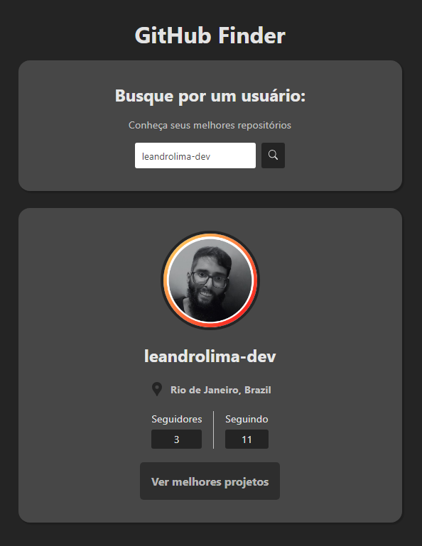
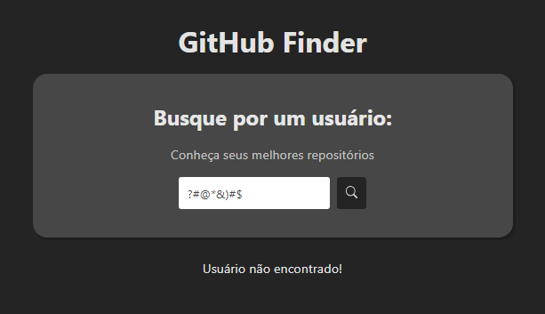

<h1 align="center">GitHub Finder</h1>

Projeto realizado em aula no YouTube pelo professor Matheus Battisti.

  <a href="#-tecnologias">Tecnologias</a>&nbsp;&nbsp;&nbsp;|&nbsp;&nbsp;&nbsp;
  <a href="#-projeto">Projeto</a>&nbsp;&nbsp;&nbsp;|&nbsp;&nbsp;&nbsp;
  <a href="#-layout">Layout</a>&nbsp;&nbsp;&nbsp;|&nbsp;&nbsp;&nbsp;
  <a href="#memo-licença">Licença</a>

  

 

  

  

## 🚀 Tecnologias

Esse projeto foi desenvolvido com as seguintes tecnologias:

- HTML5
- CSS Modules
- ReactJS
- TypeScript
- Git e Github
- Vite

## 💻 Projeto

Desenvolver um localizador de perfil de usuários do GitHub, consultando API do GitHub e retornando dados mais importantes do usuário.

## 🔖 Layout

- [Acesse aqui o projeto finalizado, online](https://beta-github-finder.vercel.app/)

## :memo: Licença

Esse projeto está sob a licença MIT.

---

Feito com ♥ by Leandro Lima